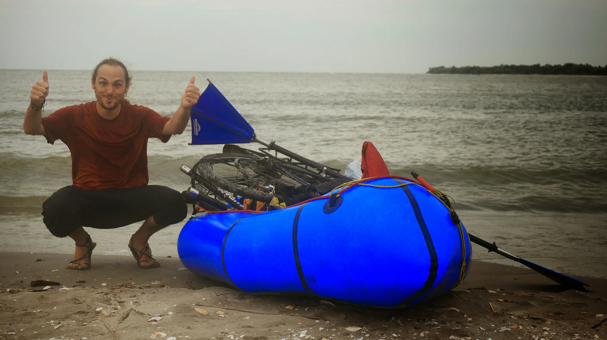
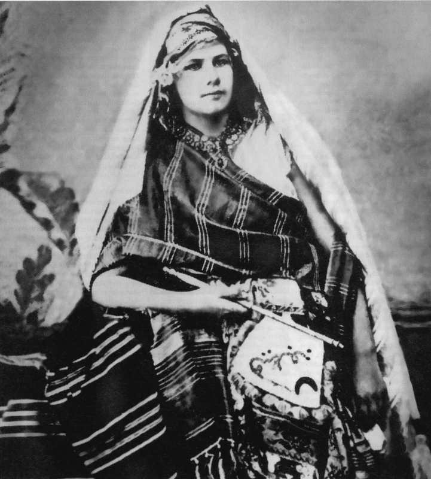

{
    :page/title  "Cleaning House: Retiring My Old Travel Blogs"
    :blog/date "2022-09-15"
    :blog/author "Casey Link"
    :blog/description "A reflection on taking down my old travel blogs and how both the internet and I have changed."
    :blog/tags #{"personal" "travel" "reflection"}
}

If you've found yourself here through an old link to `elusivetruth.net` or `binaryelysium.com`, I should probably explain: those blogs no longer exist.

I've taken them down, redirected the domains, and generally done some digital housekeeping. Apologies for dead-end.

---

For those wondering (there can't be many of you), `binaryelysium.com` and `elusivetruth.net` were my open-source dev and travel blogs from my early-to-mid twenties.
Binary Elysium started with my first excursions into open source around 2006 and chronicled my days as a KDE contributor.

When I began traveling full-time I found an audience interested in my travelogue, so Elusive Truth was spun out as a standalone blog.
Both blogs drifted for while I also drifted along with a laptop, doing contract work while experimenting with various forms of travel.

This period of time culminated in my traversal of Europe from the North Sea to the Black Sea using nothing but human power: pedaling my bike and paddling my packraft.

My arrival at the Black Sea after traversing Europe with bike and boat

I completed that journey in 2014, and had my sights set further east, but as is our way, settled down, found a partner, and started a family.

The internet has changed dramatically since those early blogging days.
What was once a more unfiltered, personal, and decidedly less commercial space has evolved into something sanitized, algorithmic, monetized, and focused on "content."

My old posts feel like artifacts from a different era. Not just an era of of my life, but of the web itself.
An era when people wrote purely for expression, no algorithms or brands in sight. I did at least (though my contributions were objectively mediocre).

My trans-European journey was partly inspired by Patrick Leigh Fermor's book "A Time of Gifts," a memoir of hiking across pre-WWII Europe in the 1930s.
A musty book despite being "only" from the '70s. 
The narrative is of a privileged white guy struggling with the self-imposed misery of traipsing through Europe with letters of invitations to high society
in his pocket but holes in shoes. 

Huh. 🤔 His story is similar to mine in most aspects. It lacks the pre-war intrigue. The letters of invitation are swapped for Couchsurfing/Warmshowers. But white and privileged, check check.

It is embarrassing reading your own writing from a decade past, especially when it's infused with the naivety characterized by that age.

Though they say the internet never forgets, I've found that's only partially true.
If you're determined and know how to use the Wayback Machine, you could probably unearth some of my old writings and photos.

But honestly, I wasn't an exceptional writer, and there were (and are) far better blogs and books on the subject.
I'm at peace with that realization now, in a way my younger self might have found disappointing.

Rather than read me, here are a few authors that influenced my deeply during those wandering years.
Their work deserves to be revisited far more than mine, especially if you're someone looking to go on an adventure.

You can find them preserved at [onvagrancy.com](https://onvagrancy.com)

My favorite piece remains ["On Vagrancy" by Isabelle Eberhardt][isabelle1], a remarkable French iconoclast who defied every convention of her era - in her 20s she was dressing as a male Arab, converting to Islam, and living as a nomadic writer in the Maghreb Sahara.

[isabelle1]: https://onvagrancy.com/isabelle/vagrancy.html

Was it a coincidence that I was around the same age when her writing gripped me so completely? Probably not, but she tragically died at 27 years old in a flash flood. Meanwhile from nearly-40 I can see what she never got the chance to.

One of the few photos of Isabelle Eberhardt

I can't let this reflection end without mentioning "The Gentle Art of Tramping" by Stephen Graham, a 1924 book which was my road bible, and I think has something for everyone.

> "The tramp is a friend of society; he is a seeker, he pays his way if he can... Tramping is a way of approach, to Nature, to your fellowman, to a nation, to a foreign nation, to beauty, to life itself."

The digital detritus of our past selves accumulates so quickly now.
Perhaps there's value in the occasional pruning—making space for the work that continues to resonate.
The words of Eberhardt and Graham still do. My early blogs don't.
