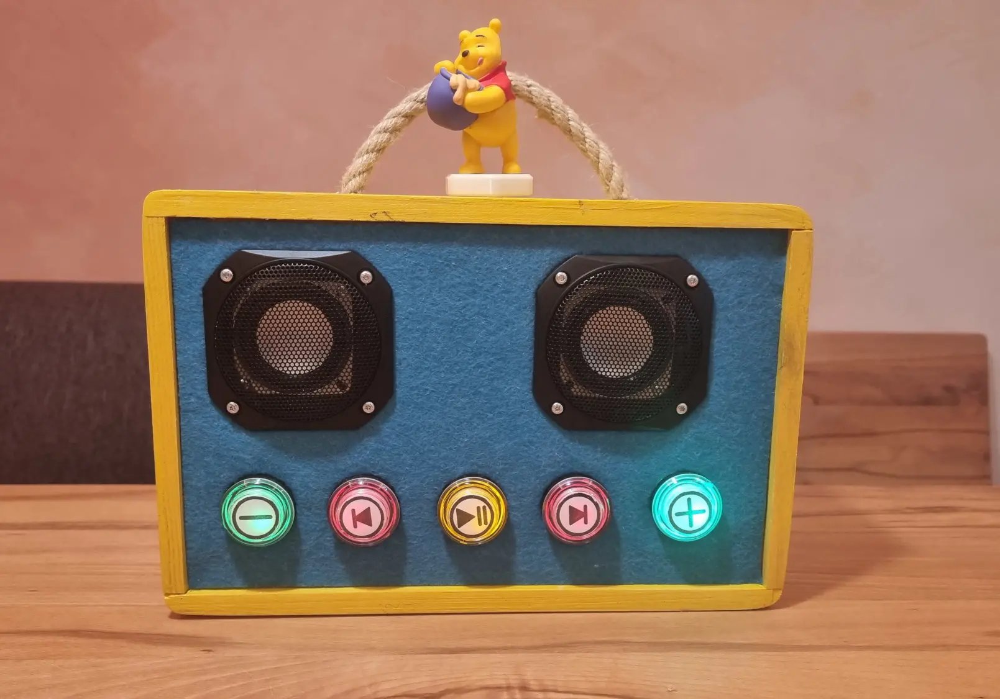
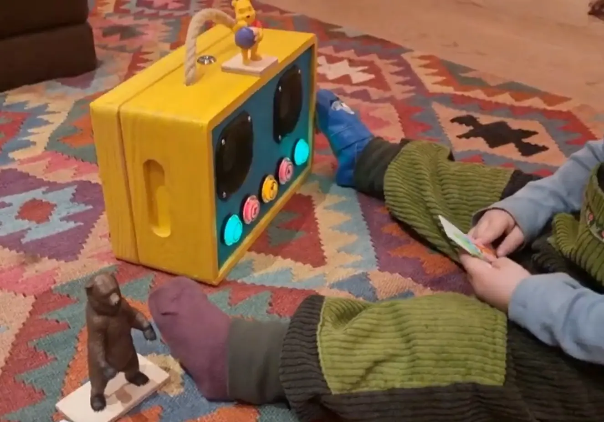

{
    :page/title  "Fairybox: Building a Better Children's Music Box"
    :blog/date "2024-04-04"
    :blog/modified "2024-05-30"
    :blog/author "Casey Link"
    :blog/description "Creating a screen-free, RFID-powered audio player for my children using Raspberry Pi, Clojure, and a lot of soldering."
    :blog/tags #{"maker" "raspberry-pi" "parenting" "clojure" "hardware"}
}
# Fairybox: My Screen-less Children's Music Box

It's strange working in tech and being a parent. I sell software as a solution, but in so many ways software is the cause of strife and problems in our lives. And specifically I mean family life.

YouTube, Spotifiy, and friends have no place near my pre-school aged children. It's not that I'm anti-technology — obviously — but I've seen too many children zombie-scrolling to want that for my own.

When I was a child we had cassette tapes. Boxes and boxes of cassete tapes. My sister and I each had a cheap little Sony cassette player/boom box and a pair of those cheap over-ear headphones that have the thinnest black foam as ear pads.

We spent hundreds, possibly thousands, of hours listening to stories and music. Sometimes replaying the same track or story 50 times in a row. Annoying for parents yes, but repetitive listening has been shown to be very important for language development.

I want to *encourage* an interest in stories and music while letting my children have control of their media. In 2020s, how do I give a similar experience to my children without a sketchy algorithm or screens? 

### Commercial Off the Shelf: Toniebox

If you're not familiar with the Toniebox concept, it's brilliant in its simplicity: a colorful cube that plays audio when children place special figurines (called "Tonies") on top. No screens, no complicated interfaces — just place a character and hear a story. The figures use RFID chips that the box recognizes, triggering specific content that is cached on the box itself.

It really is a great product, however *cost* is a problem. The Toniebox itself plus a Tonie figure costs around €100, and every Tonie thereafter costs €18-25.

And that's just for German language Tonies. My children are being raised bilinguaglly in English and German, with German naturally dominant given where we live.

Importing English language Tonies from the UK bumps the cost of a Tonie up to €25-30 (thanks Brexit!), and those are British-English. I'm not trying to be snobbish here, but we speak American English and home and I don't think it is unreasonable to want to make the same dialect available to my kids in their audio diet.

Importing Tonies from the USA? Now you are looking at €35-40 per Tonie. Yikes.

As an amateur maker, the answer seemed obvious, I needed to DIY this myself[^f1].

[^f1]: This economic argument falls apart if you calculate total time spent, material cost, etc.

My goals were simple:
1. Create a device my child could use independently
2. Keep it screen-free (for the child, anyway)
3. Use open source tech
4. Make it robust enough to survive a preschooler

### Clojure, LibVLC, and the Event-Driven Rabbit Hole

I decided to build the project in Clojure, partly because I love the language, but mostly because its concurrency model with core.async channels makes building an event-driven system a joy rather than a nightmare. I'd never actually used core.async as the central abstraction in a project before. It works (and might be elegant?), but it can turn into a bit of a tangled mess if you're not careful with your channels.

```clojure
;; The pub/sub at the heart of fairybox
(defn emit! [bus topic value]
  (let [pub-ch (:publisher bus)]
    (async/put! pub-ch {:topic topic :value value})))

;; And how to subscribe to events
(defn subscribe [bus topic]
  (let [sub-ch (async/chan 10)
        pub (:publication bus)]
    (async/sub pub topic sub-ch)
    sub-ch))

;; Example usage in a component
(defn start-button-listener [bus button-gpio action]
  (let [events (subscribe bus :buttons)]
    (go-loop []
      (when-let [event (<! events)]
        (when (= (:gpio event) button-gpio)
          (emit! bus :player/commands {:action action}))
        (recur)))))
```

Every component of the system — the RFID reader, the buttons, the LEDs, the audio player — communicates through this event system. When your toddler places an RFID card on the reader, it sends an event that gets picked up by the audio component, which then plays the associated content. Simple, elegant, robust.

One decision I'm particularly proud of was keeping the media player in-process using LibVLC rather than shelling out to a separate player. The Java bindings for LibVLC are surprisingly comprehensive and work well, even though they're excruciatingly Java-y with their `AbstractFactoryBuilderImplementationFactoryImpl` naming conventions. But hey, at least I didn't have to write the JNI bindings myself.

```clojure
;; Using LibVLC to play media without spawning external processes
(defn play! [player url]
  (-> player
      (.mediaPlayer)
      (.media)
      (.play url nil)))
```

### The Web UI: HTMX and Websockets for the Win

While the device itself is deliberately screen-free for my child, I still needed a way for parents to configure it. Enter HTMX and websockets — a surprisingly powerful combination that let me build a responsive web interface with minimal JavaScript.

The UI lets me assign RFID cards to specific audiobooks or playlists, control volume, and see what my kid is listening to. It's accessible from any device on our home network, which means I can easily change settings or help troubleshoot from my phone while my child is using the device. The interface updates in real-time when buttons are pressed on the physical device, making the whole thing feel cohesive (which, considering my partner and I are the only users, is probably an excessive level of polish, but whatever).

```clojure
;; A taste of the HTMX magic
(defn audio-controls [req]
  [:div#audio-controls.audio-controls
   {:hx-ext "ws" 
    :ws-connect "/ws/audio-controls"}
   [:div.audio-title 
    [:span#title "Ready to play"]]
   [:div.controls-row
    [:button.control-button 
     {:hx-ws "send" :hx-vals {:action "prev"}}
     (icon/prev)]]])
```

The websocket connection keeps the UI in sync with the device state. When my daughter hits the physical "next track" button, the web UI updates instantly to show the new track. It's a small touch, but it makes the entire experience feel seamless.

### Hardware Woes: The NixOS Experiment That Broke My Spirit

I've been using NixOS for years on my servers and Linux boxes, not just as a development environment. I thought, "Wouldn't it be elegant to deploy the Fairybox on NixOS too?" This, friends, is what we call technological hubris of the highest order.

What followed was a weeks-long battle with device tree overlays, GPIO permissions, and the peculiarities of the Raspberry Pi 4. It turns out that while NixOS runs beautifully on the Pi, accessing GPIO pins and using device tree overlays is... let me put it this way: if you ever want to feel truly humbled by your own incompetence, try getting a NixOS RPi4 to talk to an RFID reader over SPI while also driving PWM LEDs.

```nix
# A painful snippet from my failed NixOS experiment
hardware.deviceTree = {
  enable = true;
  filter = lib.mkForce "bcm2711-rpi-4-b.dtb";
  overlays = [
    {
      name = "spi0-1cs-overlay";
      dtsText = builtins.readFile ./overlays/spi0-1cs-overlay.dts;
    }
  ];
};
```

I banged my head against this wall for what seemed like eternity. I'd get one component working, only to find that another stopped. After exhausting every forum post, GitHub issue, and Discord chat I could find, I admitted defeat. I returned to a more conventional Raspberry Pi OS setup and deployed everything with a simple Ansible playbook. Sometimes the boring solution is the right one.

### Hardware Iterations and Soldering Disasters

Let me tell you something about toddlers: they're walking chaos engines. No matter how well you think you've secured your hardware connections, a determined 3-year-old will find a way to jostle something loose. 

The Fairybox went through several hardware iterations, especially the power solution. The first version used a standard USB power bank, but the Raspberry Pi would occasionally brown out when playing audio at high volumes. The second version used a LiPo battery with a simple boost converter, which lasted longer but still had stability issues.

For the final version, I went full overkill and got a KWeld spot welder (a whole other DIY project) to build a custom battery pack, paired with the AmpRipper 4000 charge controller/boost converter. This gives me a stable 5V 3A power supply that can run for hours and recharge quickly.

Despite years of practice, my soldering skills remain firmly in the "functional but ugly" category. Every time I open up the Fairybox to fix something, I'm confronted with blobs of solder that look like they were applied by someone wearing boxing gloves. But hey, they conduct electricity, and that's what counts, right?

### The Final Product: A Box Full of Joy

The finished Fairybox sits in my daughter's room (when she's not carrying it around the apartment), a simple wooden box with colorful LED buttons. She places an RFID card on top, the lights dance in acknowledgment, and her favorite audiobook begins playing. She can press the big, friendly buttons to pause, skip tracks, or adjust volume.



What amazes me is how quickly she mastered it. There's something wonderfully intuitive about physical interfaces — no menus to navigate, no apps to open, just tangible cause and effect. (Though I should admit "intuitive" is stretching it a bit — it took her a couple weeks of placing cards and repeatedly asking "What does this button do again?" before she fully got the hang of it.)

Now my youngest is starting to get jealous, giving me the perfect excuse to build version 2.0. I've already started gathering components and thinking about improvements. I'm slightly terrified at the prospect of having two audio devices wandering around our not-very-large apartment, potentially blaring different stories at maximum volume simultaneously. I may need to include some kind of proximity sensor that lowers the volume when they get too close to each other.

### Beyond the Build: Technology That Respects Childhood

This project has reinforced my belief that technology doesn't have to mean screens and apps. We can build digital tools that respect the developmental needs of children — tools that encourage imagination rather than passive consumption.

As someone who builds technology for a living, I feel a responsibility to be thoughtful about the digital environments I create, especially for the most vulnerable users. My clients are human rights organizations trying to make the world better. Shouldn't I apply the same principles at home?

The Fairybox isn't just a toy — it's a statement about the kind of technology I want in my children's lives: respectful, empowering, and imagination-enhancing rather than attention-extracting.

And if you're wondering if all this effort was worth it when I could have just bought something off the shelf — the look on my daughter's face when she first used something Dad built answers that question perfectly.



Now I just need to finish the second one before my youngest figures out how to stage a toddler coup.

[proj]: https://github.com/Ramblurr/fairybox
