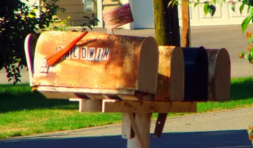

{
    :page/title  "PBM is dead! Long live PBM!"
    :blog/date "2011-03-12"
    :blog/modified "2025-06-01"
    :blog/author "Casey Link"
    :blog/description "PBM gaming created experiences of depth and anticipation that modern games can't match—and there's still a place for this imaginative style in our fast-paced world."
    :blog/tags #{"play-by-mail" "evergreen"}
}

"Photo (C) silverlunace. CC licensed."

> Play-by-mail gaming

Assuming you know what it is, I suspect that phrase produces two different reactions in the minds of those who read it. Either it conjures up fond memories of a special era in gaming, an era in which you spent hours with piles of papers haphazardly spread about, lost in the universe of your imagination, and then hours more in anticipation waiting for that darned post man to arrive at your mailbox with the results of your dastardly scheming or the outcome of a space battle of truly epic proportions; or that phrase incites an altogether different thought, one of a bygone era of rotary telephones or a hand written letters, which is to say thoughts of the recently antiquated.

"Photo (C) R Sull. CC licensed."

The postal system as a medium for gaming has certainly declined in recent decades, and unfortunately the number of games in the style that PBM (play-by-mail) promoted has declined as well. In the 90's e-mail developed, and many PBMs became PBEMs (play-by-email) with much success; however the transition to the Internet did not fair as well.  The way most people use and view the Internet is directly contradictory to the important core mechanic of *anticipation* (i.e., lack of instant feedback). After all, the Internet enabled real-time mechanics that were previously impossible (not to mention the advances in computers that allow for 3d graphics). 

This PBM style can be generally summed up in this laundry list:

* **Asynchronous**, **turn based play** -- players didn't have to gather and play simultaneously
* **Multiplayer** -- player interaction was a driving force
* **Massive scale** -- a position consisted of running an empire or a a group of characters
* **Depth** -- large number of possible player actions
* Use of **anticipation** and **suspense** to keep players interested
* **[Imagination]** based -- as opposed to graphic visuals

Imagination has been replaced with intense 3D visuals. The feeling of anticipation and suspense was replaced by instant gratification made possible by real-time feedback systems. Turn based, asynchronous multiplayer was replaced by real-time synchronous multiplayer. As a result of these replacements, the depth and scale of modern games has suffered. For example, in a real-time strategy game you can't have both massive scale and extreme depth, unless you want games to last for days, a big drawback for multiplayer games. These supplanted qualities thrived in a postal medium, where long and careful planning was favored over instant feedback.

<pre aria-hidden="true">
 ****************************
 |                          |
 |        _       __        |
 |       / \     |  \       |
 |      /   \    |   \      |
 |     /         |    \     |
 |    /          |     \    |
 |   /           |      \   |
 |  (ONQUEST and |ESTINY )  |
 |   \           |      /   |
 |    \          |     /    |
 |     \         |    /     |
 |      \   /    |   /      |
 |       \_/     |__/       |
 |                          |
 |                          |
 ****************************
</pre>

Many people don't fully understand the depth and scale of these old PBM games. These games were not limited to your familiar chess, scrabble, and diplomacy games. They were the first true massively multiplayer games. For example, one such game was [Conquest and Destiny][cad], an open-ended, civilization building, role playing game that ran in the early 90s in which every player commanded his/her own race of custom designed beings. The game galaxy had over 7 million stars and planets to explore, colonize, and conquer. While it boasted players in the hundreds or thousands as opposed to [EVE Online's 300,000+][eve] or [World of Warcraft's 10 million+][wow], it was definitely a massive game for its time. Conquest and Destiny lived and died before the Internet, consequently all we have left from this massive text-based universe is a [rulebook and advertisement][cad] rescued from the bowels of USENET. Undoubtedly there were many fascinating inter-player narratives of the kind EVE is famous for, but we'll never read them.

Hyborian War Logo (C) Reality Simulations, Inc.

Another example of a massive PBM is [Hyborian War][hyborianwar], a game of imperial conquest in the age of Conan. It began in the 1980s and is still running strong today! Check out an [example turn report][hybwarreport] for a Hyborian War position, courtesy of GrimFinger's [Hyborian War site][grimhybwar]. There were hundreds of these games once upon a time (a by all means non-exhaustive list can be found [here][boneyard]).

Internet powered real-time, graphical games are not the logical conclusion of modern gaming. That is, I do not believe real-time is better than turn-based simply because it is newer, for proof of this look no further than the wildly successful Civilization franchise. 

Bringing PBM into the second decade of the 21st century faces a major hurdle: the modern generation of gamers might not have the patience or interest in playing a game where feedback between turns is measured in days or more. I suspect this isn't an immutable fact, rather gamers simply need to be (re) introduced to the style and their imaginations reactivated. 

The turn-based, long-term, and imaginative play-style is certainly still possible, and in today's fast-paced media intensive life it might be a welcome respite to many gamers.

[eve]: http://www.eveonline.com/news.asp?a=single&nid=3044&tid=1
[wow]: http://www.gamasutra.com/php-bin/news_index.php?story=17062
[cad]: http://binaryelysium.com/pbm/conquest_and_destiny/ "Conquest and Destiny Archive"
[boneyard]: http://playbymail.net/mybb/showthread.php?tid=2 "GrimFinger's list of PBM games"
[hyborianwar]: http://reality.com/hwpcont.htm "Hyborian War main site"
[hybwarreport]: http://grimfinger.net/HWKingdomReports/AquiloniaKingdomReport.pdf "Hyborian War example turn report"
[grimhybwar]: http://grimfinger.net/HyborianWar.html
[imagination]: http://playbymail.net/mybb/showthread.php?tid=34 "PBM : Your portal to the core of your imagination"
