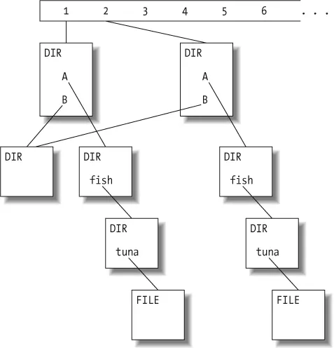
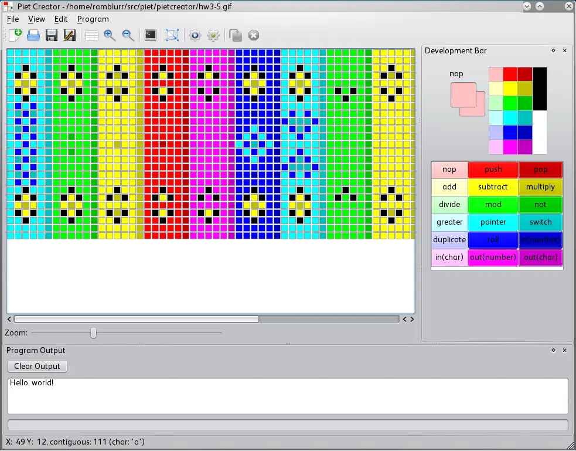
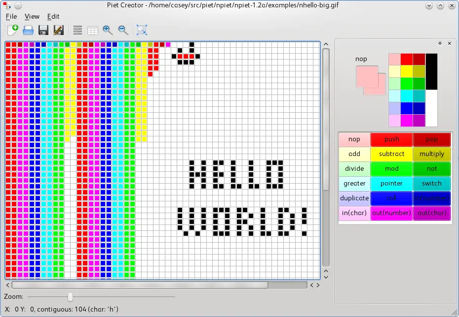

{
    :page/title  "Programming as Modern Art"
    :blog/date "2010-11-06"
    :blog/modified "2025-06-01"
    :blog/author "Casey Link"
    :blog/description "Piet is a programming language where code looks like abstract art. Frustrated by the lack of tools, I built a graphical IDE to make coding in colors actually usable."
    :blog/tags #{"evergreen" "qt" "piet"}
}

As a coder I'm always on the lookout for interesting technologies to complement my toolset.
This is not a post about one of those technologies.

There is a class of programming languages classified as '*esoteric*'.
While programming languages designed for production use concern themselves with practical features such as readability, performance, and flexibility, esoteric languages explore the boundaries of language design with rampant disregard for all the aforementioned features.
A few famous examples of esoteric programming languages (if it even makes sense to refer to an esoteric something as famous) are [Brainfuck][brainfuck], [LOLCODE][lolcode], and [Malbolge][malbolge].

In this post I want to talk about an esoteric language that attempts to breakout of a mold every other programming language has taken for granted.
This language is [Piet][piet] and was created by [David Morgan-Mar][david].

From [Piet's specification][piet]:

> Piet is a programming language in which programs look like abstract paintings. The language is named after Piet Mondrian, who pioneered the field of geometric abstract art.

Sample Piet program

Piet differs from nearly every other language because it is expressed not as text but as colored blocks.
Importantly, Piet does not use a simple one-to-one mapping of operations onto colors such as "add is green and divide is red" for that would be trivial and uninteresting.
Rather operations are represented as changes in hue and lightness.
It is a stack oriented language with low-level operations on par with many Assembly languages.
To the left is a sample Piet program, created by Thomas Schoch.
It prints "Piet!", and is designed to look like a painting of Piet Mondrian.
The image is **literally** the program.
If you are interested in how the language works, I suggest you take a peek at the [specification][piet], because there is much more to it than I presented here.

Often a piece of code is referred to as beautiful or ugly; however, what the speaker usually means is that the algorithm, idea, or strategy behind the code is beautiful or elegant.
Rarely can you present a piece of code and speak of the code itself as possessing the aesthetic qualities we associate with things of real beauty.

A tree diagram of Subversion's Delta Editor from Beautiful Code

This is a figure from Karl Fogel's chapter in Orielly's book [Beautiful Code][beautiful-code] on Subversion's Delta Editor (full chapter [here][chapter-2]).
Is the beauty of that tree diagram not immediately apparent to you?
Don't worry, it wasn't obvious to the author either.

> I cannot claim that the beauty of this interface was immediately obvious to me. - Karl Fogel

Piet is an attempt to provide a functional language that can be used to create beautiful programs in the style of modern abstract painters.
The [sample programs][samples] page has quite a few examples of programs written in Piet.
Some are beautiful and others are downright ugly.

Take these two programs:

They both print the string "Hello World", yet one is obviously more appealing than the other.
Furthermore, the aesthetic properties of each program can be judged by any layman.

Intrigued by this concept of beautiful programs, I set out to create such a program in Piet, but I soon realized that in breaking out of the confines of the text editor Piet had nowhere else to land.
That is, conventional image editors (such as the GIMP) are not suited to creating Piet programs.
This is because operations in Piet are defined as *changes* between hue and lightness, which means to know which operation one particular pixel represents you must know the operations of every preceding pixel.
Without assistance from the editor creating a program of any non-trivial length is extremely difficult.
You are unlikely to understand even a non-trivial program after putting it down for several days.

There are [a couple][tools] development tools for Piet out there, but most are incomplete or are suffering from bit rot.
Given the graphical nature of Piet it only makes sense that the IDE and debugger should be graphical as well.
With this in mind and convinced that Piet could actually be a usable langauge given the right environment, I have developed an IDE and debugger.

[Piet Creator][piet-creator] lives on github.
It is written in C++ w/ Qt, so should compile on Windows, Mac, and Linux.
It has only been tested on Linux.

The application is named [Piet Creator][piet-creator] and the [source][source] is up on github released under the GPL v3.
It is written in C++ with Qt, so it should run on Linux, Mac, and Windows platforms, but I have only tested in on Linux.
For the backend interpreter it uses a slightly modified version of the fantastic Piet interpreter [npiet][npiet] written by Erik Schoenfelder.

Practically speaking I realize Piet and Piet Creator are probably useless.
Though, I am convinced many programmers take themselves too seriously, so Piet Creator is a serious exercise in not being serious.

I have grand (if silly) visions for Piet and Piet Creator: sub-procedures, standard libraries, and arbitrary color sets.
Imagine a world where programmers aren't viewed as digital carpenters or engineers pushing bits around to some functional end, but intriguing artists slinging color across a digital canvas creating functional art appreciable by all.

[brainfuck]: http://www.muppetlabs.com/~breadbox/bf/
[lolcode]: http://lolcode.com/
[malbolge]: http://en.wikipedia.org/wiki/Malbolge
[piet]: http://www.dangermouse.net/esoteric/piet.html
[david]: http://www.dangermouse.net/
[beautiful-code]: http://beautifulcode.oreillynet.com/
[chapter-2]: http://www.red-bean.com/kfogel/beautiful-code/bc-chapter-02.html
[samples]: http://www.dangermouse.net/esoteric/piet/samples.html
[tools]: http://www.dangermouse.net/esoteric/piet/tools.html
[piet-creator]: http://github.com/Ramblurr/PietCreator/wiki
[source]: https://github.com/Ramblurr/PietCreator
[npiet]: http://www.bertnase.de/npiet/
